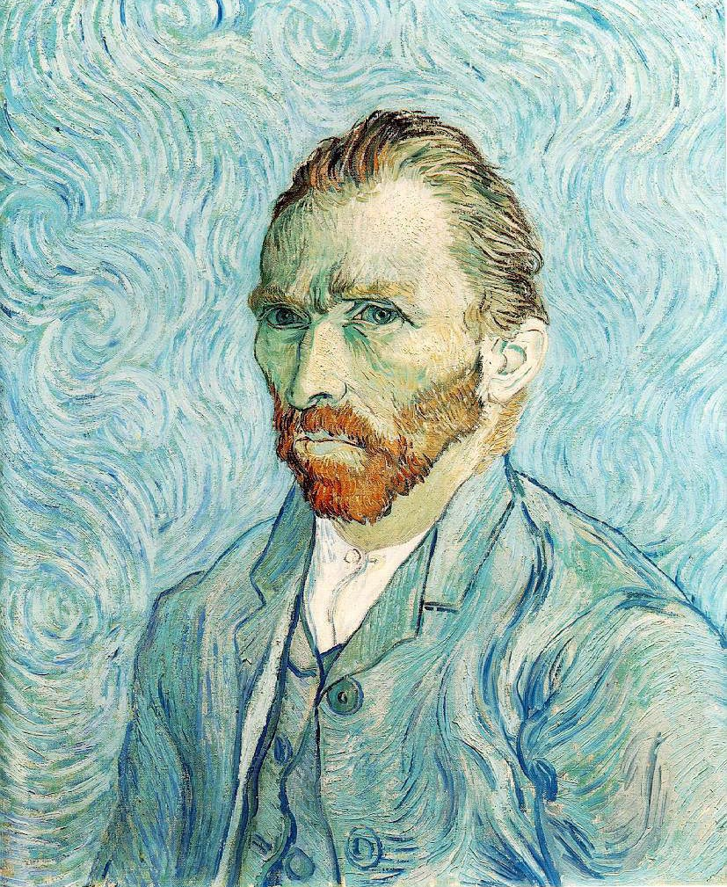
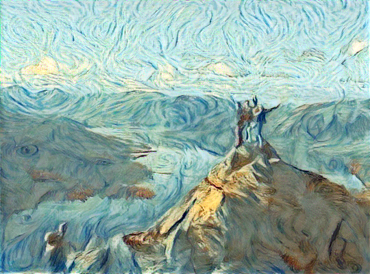
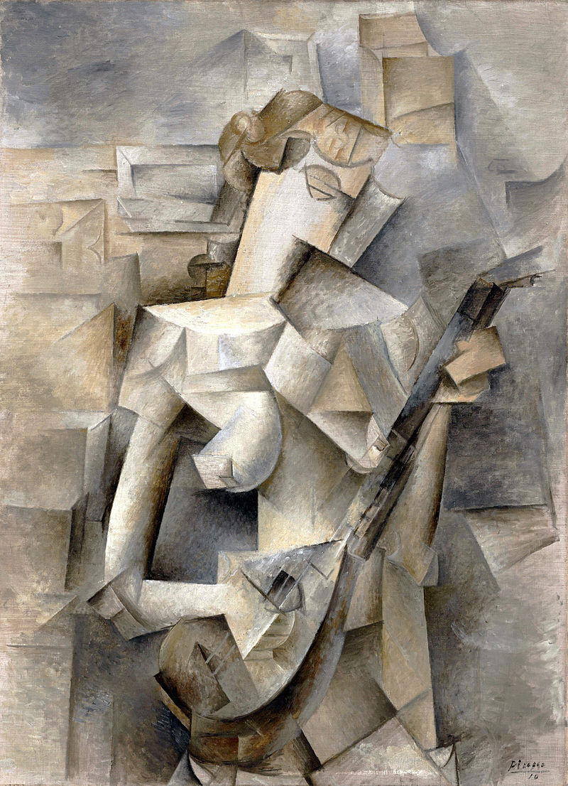
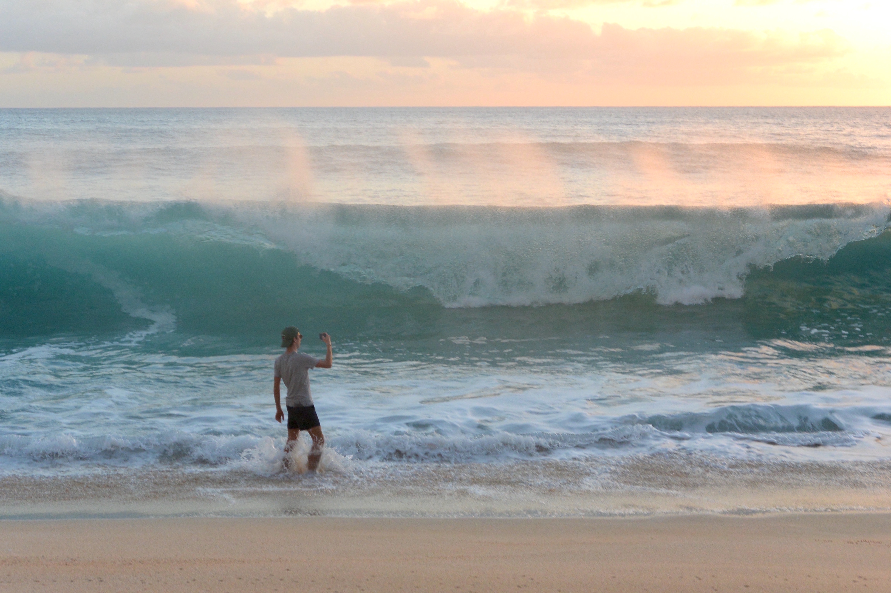
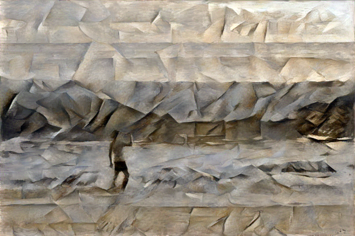
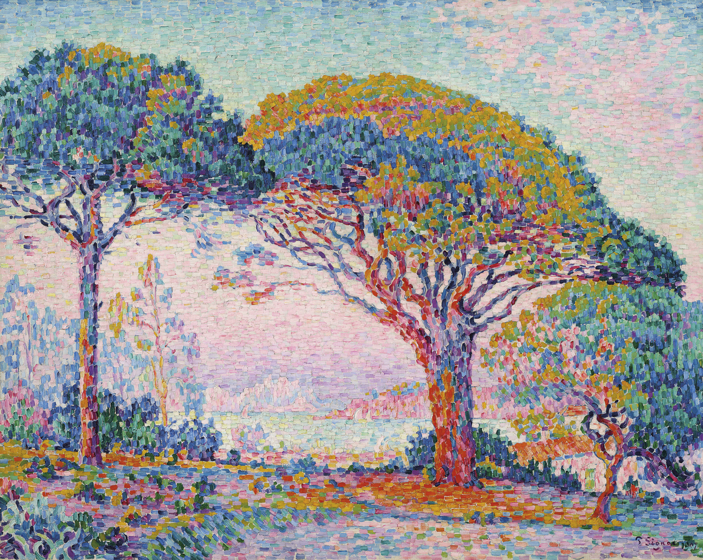
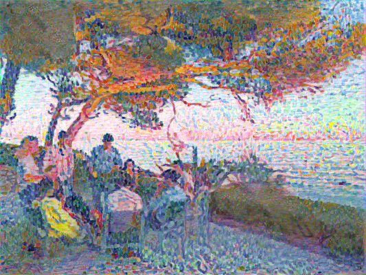
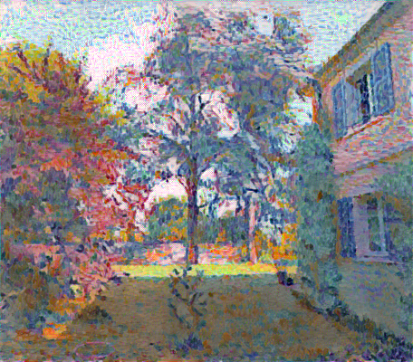

# Neural_Style_Transfer_Flask

In this repository you'll find a simple app built with `flask` to perform NST using `pytorch`. You'll also find a notebook version of the model to run it on GPU with Colab or Kaggle.

> Neural Style Transfer (NST) is a deep learning method that allows you to **apply a new artistic style to any image**, using neural networks. The algorithm takes any image as input, transfers the artistic style from another chosen image, and outputs a transformed version.
>
> The idea is that it is possible to use a pre-trained convolutional neural network (here, [VGG19](https://www.reddit.com/r/MachineLearning/comments/7rrrk3/d_eat_your_vggtables_or_why_does_neural_style/), trained originally for image recognition) to separate the style representation and the content representation from an image. You can then define a dual loss function which corresponds (1) to the difference in style between 2 images (the 'input' and the 'style' images), and (2) to the difference in content between the 'input' and the 'output' images. When you minimize this function with gradient descent, you transfer style from one image to the other, while making sure content isn't lost in the process.

You can download/clone the repository and run the app locally. Just `cd` into the right folder, run `python app_nst.py` in cmd, and go to `localhost:5000` in your browser.

The app and models were inspired by several blog posts ([1](https://medium.com/@artistritul1995/style-transfer-using-deep-nural-network-and-pytorch-3fae1c2dd73e), [2](https://towardsdatascience.com/how-to-get-beautiful-results-with-neural-style-transfer-75d0c05d6489), [3](https://pytorch.org/tutorials/advanced/neural_style_tutorial.html), [4](https://towardsdatascience.com/light-on-math-machine-learning-intuitive-guide-to-neural-style-transfer-ef88e46697ee), [5](https://medium.com/@shwetaka1988/a-complete-step-wise-guide-on-neural-style-transfer-9f60b22b4f75)), which themselves were based on the original NST research article _"A Neural Algorithm of Artistic Style"_ by [Gatys _et al._](https://arxiv.org/abs/1508.06576) (2015).

---

### Examples of results

* Van Gogh painting style (Vincent van Gogh, [_Portrait de l'artiste_](https://www.musee-orsay.fr/fr/collections/oeuvres-commentees/peinture/commentaire_id/self-portrait-2990.html?cHash=680aadb7da), 1889):

<table>
<tr>
  <td align='center' colspan=2> <strong> Style
<tr>
  <td align='center' colspan=2>  
<tr>
  <th>Input <th> Output
<tr>
  <td> 
  <td> 
</table>

* Cubist painting style (Pablo Picasso, [_Jeune fille à la mandoline_](https://www.moma.org/collection/works/80430), 1910):

<table>
<tr>
  <td align='center' colspan=2> <strong> Style
<tr>
  <td align='center' colspan=2>  
<tr>
  <th>Input <th> Output
<tr>
  <td> 
  <td> 
</table>

* Pointillist painting style (Paul Signac, [_La Baie (Saint-Tropez)_](https://www.christies.com/lotfinder/Lot/paul-signac-1863-1935-la-baie-saint-tropez-6202464-details.aspx), 1907):

<table>
<tr>
  <td align='center' colspan=2> <strong> Style
<tr>
  <td align='center' colspan=2>  
<tr>
  <th>Input <th> Output
<tr>
  <td> 
  <td> 
</table>

<!-- Other way to build a table (Github Flavored Markdown, less flexible):
Input | Style | Output
:---:|:---:|:---:
 |  | 
-->

---

### Next steps

By order of importance:  
* tweak the model to improve output quality (see [[2]](https://towardsdatascience.com/how-to-get-beautiful-results-with-neural-style-transfer-75d0c05d6489)) and computation speed (for now, running it without GPU is quite prohibitive)
* improve the app by adding a computation progress bar and the possibilty to upload your own style images 
* explore cloud server possibilities to potentially put the app online (see this [blog post](https://blog.usejournal.com/how-i-built-and-deployed-my-first-machine-learning-project-4c75d1effe4e), and heroku or tensorflow.js possibilities)
* if I really, really have time, explore other ideas such as building a [mobile app](https://heartbeat.fritz.ai/style-transfer-on-ios-using-convolutional-neural-networks-616fd748ece4) around the model or [processing video](https://towardsdatascience.com/real-time-video-neural-style-transfer-9f6f84590832).
